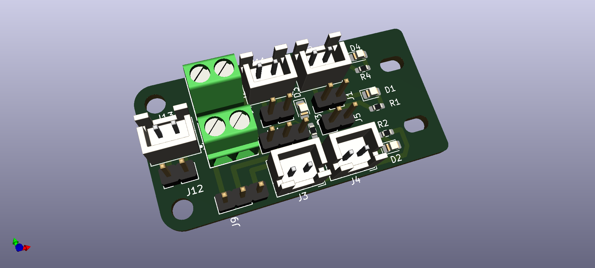

# 3DP_HotEnd_Breakout
PCB breakout board to tidy up the wiring at the hotend of a 3D Printer. 

Uses 5, 2-Pin JST XH_B2B-AM sockets
1, 3.5mm pitch screw terminal (Phoenix_Contact-1751248) or equivalent
3, 0603 SMD Resistors, 760Ohm to 1KOhm
3, 0805 LED's

Headers are shown, but thru-hole soldering of the wires directly to the baord is also possible. 

2 holes for screw mounting as well as 2 slotted holes to zip-tie and secure the wires. 

