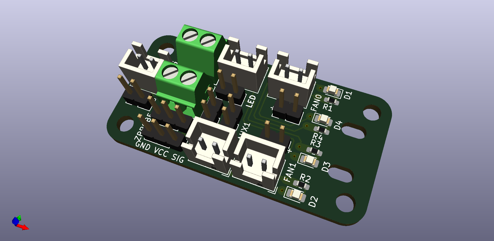

# 3DP_HotEnd_Breakout
PCB breakout board to tidy up the wiring at the hotend of a 3D Printer.  

Details: 
Traces on top & bottom.  
Hot End traces are estaimted to carry a maximum current of 5A at 2C temp rise.   
This should in theory handle up to a 12v-50W heater using a 2-layer PCB with 1oz copper on each face.    
Solder pads for SMT components are prortioned for hand soldeirng. SMT componnents are optional Pads are sized for 1206 sized components, but can be populated with as small as 0603's.     

KiCAD generated .step file included for your convenience.  

Connectors provided for:  
E0 hot end, with screw terminals, same connector as on Duet2/3 hardware 
THERM themrmistor, JST XH / male header pins  
FAN0: 1  hot end cooling fan, JST XH  / male header pins  
FAN1: 2 part cooling fans, JST XH / male header pins   
1 3-pin Z Probe connection  
1 2-pin LED connection 
1 2-pin AUX connection   

LED's are optional. I like the convenience of seeing an indicator when observing my printer via webcam. I can not see the fans when they are running, so I added traces for indicator LED's. Similalry, not being abel to see the controller's LED's I added an indicator LED tied to the hotend and the LED circuit.    

One addtional JST connector is provided in the event you are using a BL_Touch and require 5 conductors, 3+2. Else, the JST can be used for general purpose LED lighting of the carraige.       

Male solder headers are shown, but thru-hole soldering of the wires directly to the board is prefered.    

M3 screw holes are provided in the corners frou mounting, as well as 2 slotted holes for a zip-tie to secure the board/wires.   

Board dimensions are approximteley 48mm x 24mm (1.87x0.93 inch)   
As of 11/2020, $8.65 for 3 boards fabbed at OSHPark.    

BOM:    
5, 2-Pin JST XH_B2B-AM sockets  
    <https://octopart.com/b2b-xh-a%28lf%29%28sn%29-jst-7424860?r=sp>  
2, 3.5mm pitch screw terminal (Phoenix Contact 1751248) or equivalent  
    <https://octopart.com/search?q=Phoenix+Contact+1751248&currency=USD&specs=0>  
4, 0603 -1206 SMD Resistors, 760Ohm to 1KOhm  
    <https://octopart.com/search?q=0603+resistor&currency=USD&specs=0&resistance=1000>  
4, 0805 -1206 LED's of your choosing  
    <https://octopart.com/search?q=0805+LED&currency=USD&specs=0>  
6, 2 pin Male headers  
2, 3 pin Male headers  

